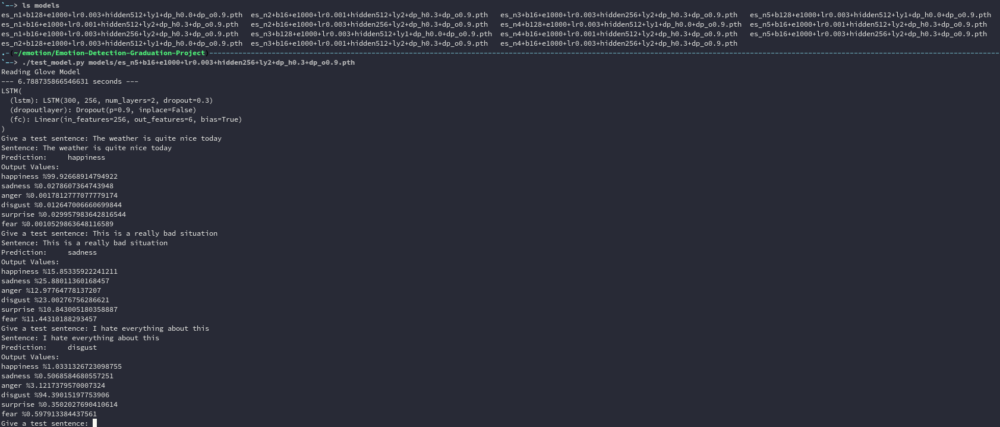

# Emotion Detection - Graduation Project
My graduation project from Dokuz Eylul University, 2019.

It uses GloVe word vectors, data from different places to train a model that can detect emotion in English sentences.

## Dependencies
* `jre-openjdk-headless`
* `python-pytorch-cuda`
* `python-nltk`
* `python-scikit-learn`
* `python-pandas`
* `python-matplotlib`

## Installation

> clone the repository and change directory
```shell
$ git clone https://github.com/Fethbita/Emotion-Detection-Graduation-Project.git
$ cd Emotion-Detection-Graduation-Project
```


> download and create a pickled glove file:
```shell
$ ./download_glove.sh
```


> download and run Stanford Core NLP Server in another terminal (downloads only once):
```shell
$ ./stanford_server.sh
```


> create your dataset with create_dataset_bin.py
> this requires 2 files, first file is the annotation file, annotation for each sentence on the corresponding line
> second file as the base file, one sentence per line:
> (annotation shortcuts can be changed by editing the script)
```shell
$ ./create_dataset_bin.py <annotation_filename> <data_filename>
```


> train a network, parameters can be found in the end of the file and in the beginning of the train function declaration
```shell
$ ./Emotion_training_v3.012.py
```


> test your network (Stanford Core NLP Server needs to be running):
```shell
$ ./test_model.py <trained_model_file.pth>
```
